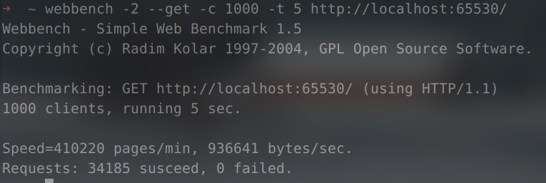

## 简介

用线程池和IO复用技术epoll实现的单Reactor多线程高并发Web服务器，[Webbench](http://home.tiscali.cz/~cz210552/webbench.html)测试结果显示QPS接近1w。支持listenfd和clientfd的LT和ET触发模式，可以在构造`webserver`类的实例时分别配置。

为了避免在ET下永久阻塞，以及提高在LT下的效率，所有file descriptor都设置为non-blocking。

这个Web服务器对Reactor并发模型的实现使用了自己写的：

- POSIX Thread线程池
- 自动扩容的char缓冲区类，模仿STL vector扩容的方式写的
- 定时调用call back销毁超时的不活跃对象的`expirer`模板类
- 同步/异步日志系统
- HTTP请求解析类和HTTP响应生成类

## 并发性能



测试环境：Ubuntu 20.04, i7 9750H, 16GB RAM

## 运行效果

我在VPS上部署了这个服务器，可以点进去看看效果：<http://www.ohiok.cyou:65530>

（由于VPS在美国，访问延迟会比较高，这不是代码的问题。这个VPS只有1核CPU，500MB内存，所以如果对这个VPS测试并发量，得到的数据不是真实的瓶颈）

（在本地运行时可以流畅打开视频，但是在VPS上运行时视频显示no video with supported format and mime type，可能和HTTP或者HTML有关，以后有空再解决）

## 安装

### requirements

- OS：Linux（因为IO multiplexing使用的是Linux下特有的epoll）
- 编译器： GCC 9.4.0 / Clang 16.0.0 测试过

### compile

```shell
git clone https://github.com/ekv0/webserver.git
cd webserver
make
```

### install

```shell
sudo make install
```

默认安装在`/usr/local/bin`，如果要指定安装路径，修改`makefile`中的`INSTALLDIR`。

### run

默认将日志写入`/var/log/webserver.log`，需要管理员权限。在debian系下，

```shell
sudo webserver
```

### uninstall

```shell
sudo make uninstall
```

## 功能

因为是web server，只服务静态资源，没有返回动态页面响应和数据库请求之类的功能。

可以对HTTP协议实现长连接（persistent）和短连接的管理。如果HTTP请求header里没有`Connection`，会根据HTTP版本决定是否使用长连接。

`webserver`类构造函数可以传入类似Nginx config file里`root`和`index`功能的参数，可配置性比较高。

### todo

- 后续有时间考虑加入类似Nginx读取配置文件运行多个server的功能，以及实现reverse proxy和fastCGI。
- 暂时只实现了GET请求的处理。后续再深入了解一下HTTP协议，然后支持其他的HTTP method

## 参考资料

要实现的功能和整体结构参考了[markparticle/WebServer](https://github.com/markparticle/WebServer)，但**具体的结构**和**大部分代码**都是自己实现的。

POSIX Thread的使用参考了 *Advanced Programming in the Unix Environment* 和Linux man(1) 。

## License

MIT