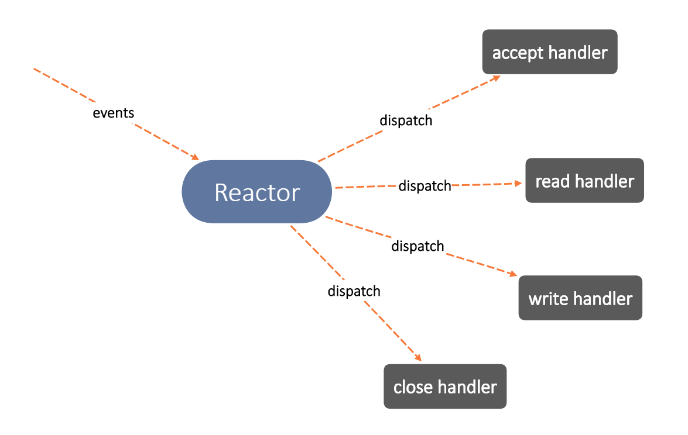

## 简介

用线程池和IO复用技术epoll实现的单Reactor多线程高并发Web服务器，实现了解析HTTP GET请求并服务静态资源的功能，支持长连接（persistent），支持异步日志，支持LT和ET触发模式，支持优雅关闭。

这个Web服务器对Reactor并发模型的实现使用了自己写的：

- POSIX Thread线程池
- 自动扩容的char缓冲区类，模仿STL vector扩容的方式写的
- 定时调用call back销毁超时的不活跃对象的`expirer`模板类
- 实现为单例模式的同步/异步日志系统
- HTTP请求解析类和HTTP响应生成类

### 单Reactor多线程



其中Reactor在主线程运行，其他三种handler运行在worker线程。

线程池的目的就是为handler提供线程资源，同时最小化线程创建和销毁的开销。

## 并发性能

测试参数：日志关闭，worker线程数量8/12

配置：Ubuntu 20.04, i7 9750H, 16GB RAM

工具：[Webbench](http://home.tiscali.cz/~cz210552/webbench.html)

2023-03-16：QPS提升到1.3w，在bug fix和把`shared_ptr`的构造由`new`改为`make_shared`之后


2023-03-02：QPS大约0.7w


## 运行效果

我在VPS上部署了这个服务器，可以点进去看看效果（可能要先刷新一次）：<http://www.ohiok.cyou:65530>

（由于VPS在美国，访问延迟会比较高，也可能被墙，这不是代码的问题。这个VPS只有1核CPU，500MB内存，所以QPS受限于硬件配置）

## 技术点

- 使用epoll实现了Reactor模式，支持LT和ET触发模式
- 使用线程提高并发度。整个程序里有四种线程：
  - 主线程(Reactor/Dispatcher)，只有一个
  - socket IO工作线程(Handler)，有多个
  - Unix signal handler线程(处理SIGALRM/SIGINT/SIGQUIT)，有一个
  - 异步日志线程，有一个。如果选择同步日志写入，那就没有这个线程
- 使用线程池避免了线程频繁创建和销毁的开销
- 使用基于std::list的`expirer`模板类关闭超时不活跃的连接，这个模板类是thread-safe的
- 使用正则表达式和状态机完成HTTP请求的解析。HTTP响应header实现了`Date`，`Connection`，`Content-type`，`Content-Length`等常用的。支持HTTP长连接
- 使用自动扩容的char缓冲区类作为HTTP请求接收、HTTP响应暂存、日志内容暂存的缓冲区
- 使用实现为单例模式的日志系统记录运行情况，具有4个日志等级，支持异步日志写入
- 用到了std::shared_ptr管理`new`和`mmap`分配的内存
- 支持优雅退出，当接收到SIGALRM/SIGQUIT信号时等待队列里的全部任务完成并释放资源后再退出

## 安装

### requirements

- OS：Linux（因为IO multiplexing使用的是Linux下特有的epoll）
- 编译器： GCC 9.4.0 / Clang 16.0.0 测试过

### compile

```shell
git clone https://github.com/ekv0/webserver.git
cd webserver
make
```

### install

```shell
sudo make install
```

默认安装在`/usr/local/bin`，如果要指定安装路径，修改`makefile`中的`INSTALLDIR`。

### run

默认将日志写入`/var/log/webserver.log`，需要管理员权限。在debian系下，

```shell
sudo webserver
```

### uninstall

```shell
sudo make uninstall
```

## todo

- 后续有时间考虑加入类似Nginx读取配置文件运行多个server的功能，以及实现reverse proxy和fastCGI
- 暂时只实现了GET请求的处理。后续再深入了解一下HTTP协议，支持其他的HTTP method
- 通过gprof分析发现很大一部分运行时间花在正则表达式匹配和std::string的构造上。后续有时间写个简单的syntax analyzer替换正则表达式和状态机来解析HTTP请求

## 参考资料

要实现的功能和整体结构参考了[markparticle/WebServer](https://github.com/markparticle/WebServer)，但**具体的结构**和**大部分代码**都是自己实现的。

IO Multiplexing和POSIX Thread参考了 *Advanced Programming in the Unix Environment* 以及Linux man(1) 。

## License

MIT
